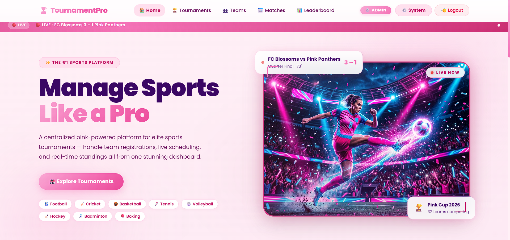
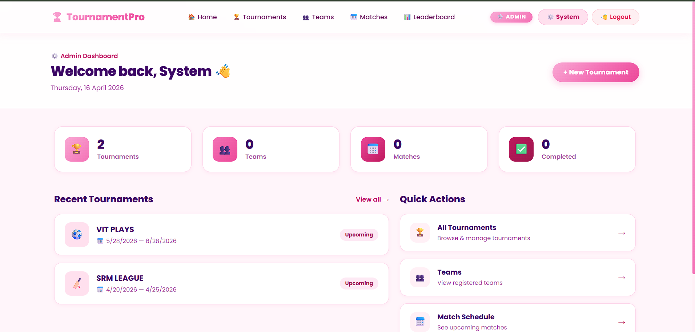
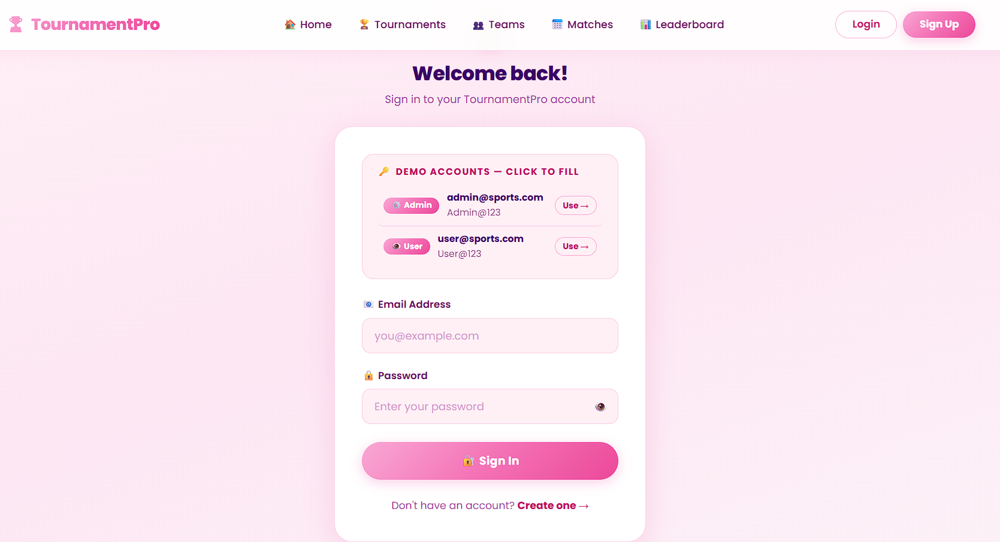
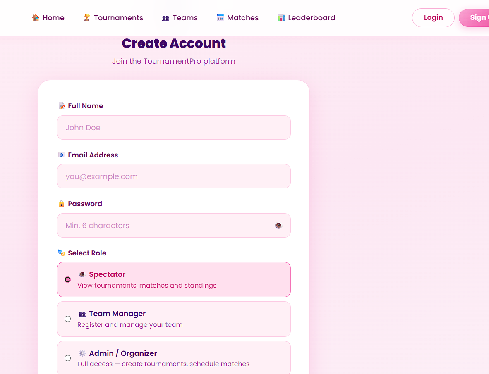

# Sports Tournament Management System

A full-stack **MERN** web application to manage sports tournaments end-to-end.

## Screenshots

<div align="center">
  
  
  <br>
  
  
</div>


## Tech Stack
- **Frontend**: React JS + Vite + Bootstrap 5
- **Backend**: Node.js + Express.js
- **Database**: MongoDB + Mongoose
- **Auth**: JWT (JSON Web Tokens) + bcryptjs

## Project Structure
```
Sports managment/
├── client/          # React Frontend (Vite)
└── server/          # Node + Express Backend
```

## Setup & Run

### Prerequisites
- Node.js v18+
- MongoDB running locally OR MongoDB Atlas URI

### 1. Backend Setup
```bash
cd server
npm install
# Edit .env file with your MongoDB URI
npm start
```

### 2. Frontend Setup
```bash
cd client
npm install
npm run dev
```

## API Endpoints
| Method | Endpoint | Description |
|---|---|---|
| POST | /api/auth/register | Register user |
| POST | /api/auth/login | Login |
| GET | /api/tournaments | List tournaments |
| POST | /api/tournaments | Create tournament (Admin) |
| GET | /api/teams | List teams |
| POST | /api/teams | Register team (Manager/Admin) |
| GET | /api/matches | List matches |
| POST | /api/matches | Schedule match (Admin) |
| PUT | /api/matches/:id/score | Enter score + auto-update standings (Admin) |
| GET | /api/standings | Get standings/leaderboard |

## User Roles
| Role | Capabilities |
|---|---|
| Admin/Organizer | Create tournaments, schedule matches, enter scores |
| Team Manager | Register & manage teams |
| Spectator | View tournaments, matches, standings |
